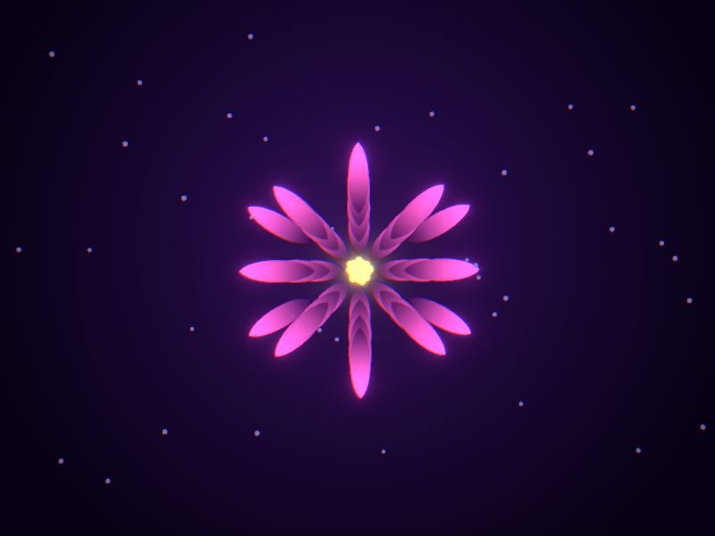
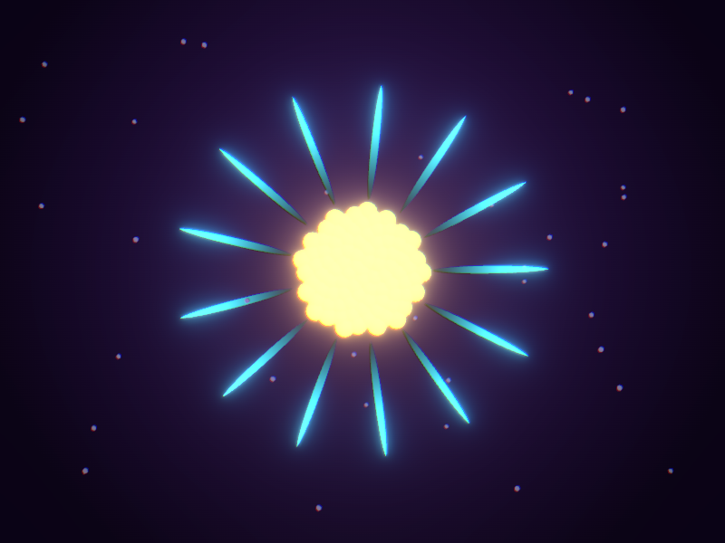
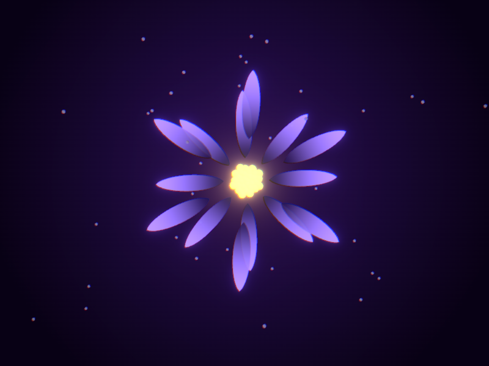
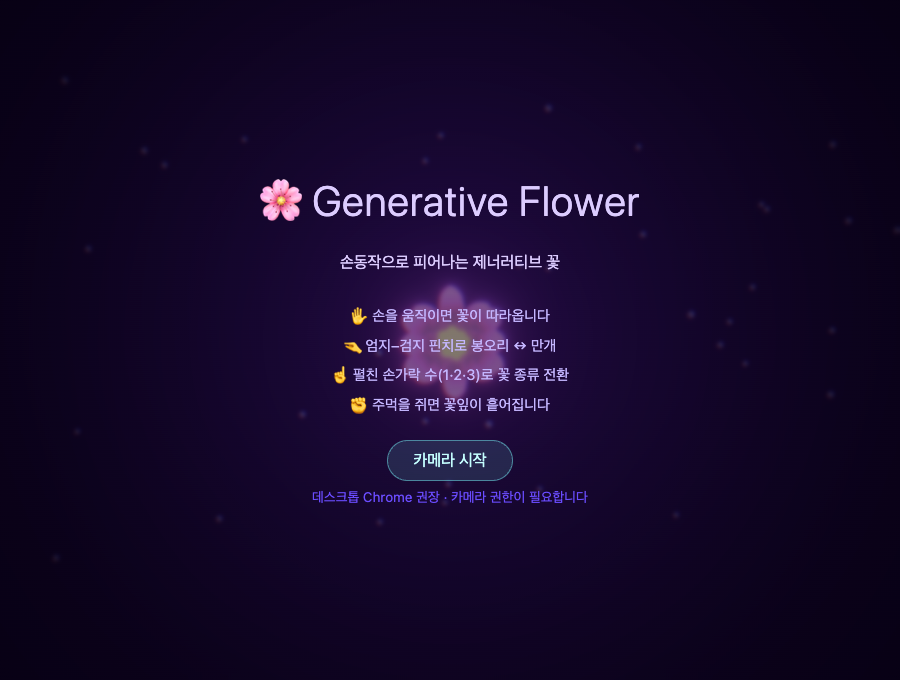

# 🌸 Generative Flower — 손동작 기반 제너러티브 꽃 미디어아트

웹캠으로 손을 인식하고(MediaPipe HandLandmarker), 손가락 제스처에 반응하는 **제너러티브 꽃 비주얼**을 Three.js(React Three Fiber)로 렌더링하는 1인용 인터랙티브 웹 데모. 모델 학습·데이터 수집 없이, 구글이 사전학습해 배포한 모델을 브라우저에서 **추론(inference)만** 한다. 톤은 *발광·몽환(Bioluminescent / Ethereal)* — 어둠 속에서 안에서부터 빛나는, 느리고 부유하는 꽃.

### ▶ 라이브 데모: **https://jinsoo-96.github.io/generative-flower/**

> ⚠️ 웹캠과 카메라 권한이 필요합니다. **데스크톱 Chrome 권장.** 카메라는 HTTPS(GitHub Pages)에서만 동작합니다.
> 카메라 없이 톤만 보려면 → [`?preview=1`](https://jinsoo-96.github.io/generative-flower/?preview=1) (옵션: `&fingers=1|2|3&bloom=0..1`)

| 장미 (rose) | 데이지 (daisy) | 연꽃 (lotus) |
| --- | --- | --- |
|  |  |  |



## 조작법

| 손동작 | 반응 |
| --- | --- |
| 손 이동 | 꽃이 손을 따라 이동 |
| 손 가까이 / 멀리 | 꽃 크기 변화 |
| 엄지–검지 핀치 | 봉오리 ↔ 만개 개화 |
| 펼친 손가락 수 (1·2·3) | 꽃 종류 전환 (장미 / 데이지 / 연꽃) |
| 손목 회전 | 꽃 회전 |
| 주먹 | 꽃잎 흩뿌리기 버스트 |

HUD에서 **Bloom**과 **디버그 오버레이(손 골격)** 를 토글할 수 있습니다.

## 기술 스택

- **Vite + React 19 + TypeScript**
- **React Three Fiber v9** / **drei v10** / **@react-three/postprocessing v3** (Bloom · Vignette · Chromatic Aberration)
- **@mediapipe/tasks-vision** `0.10.35` (HandLandmarker, WASM은 jsdelivr CDN, 모델은 `public/models/`)
- 제스처 스무딩: **One Euro Filter** (회전은 sin/cos 공간에서 필터링해 ±π wrap 안전)
- 단방향 파이프라인: webcam → landmarks → `GestureState` → (One Euro) → `gestureRef` → `useFrame` 렌더. 인식 루프(throttle ~30fps)와 렌더 루프(60fps) 분리.

## 개발

```bash
npm install
npm run dev        # 로컬 개발 서버
npm run typecheck  # tsc -b --noEmit
npm run lint       # eslint
npm run test       # vitest (합성 입력 단위 테스트 — 카메라 없이 트래킹 로직 검증)
npm run build      # tsc -b && vite build
npm run preview    # 빌드 결과 미리보기
```

- 상세 개발 명세: **[docs/DEV_PLAN.md](docs/DEV_PLAN.md)** (단일 진실 소스). 진행 로그: **[PROGRESS.md](PROGRESS.md)**.
- 카메라 영상은 자동 테스트가 불가하므로, 제스처 추출·스무딩·좌표 매핑·미러링·개화 매핑 등 그 외 로직은 모두 합성 입력으로 단위 테스트(62 tests).

## 배포

GitHub Actions가 GitHub Pages로 자동 배포합니다. 개발 중에는 `dev` 푸시마다(빌드 헬스 체크), 릴리스 후에는 `main` 푸시마다 배포됩니다. 자세한 내용은 [docs/DEV_PLAN.md §13](docs/DEV_PLAN.md).

## 성능

- 데스크톱 Chrome 30fps+ 목표. 웹캠 640×480 고정, `numHands: 1`, GPU delegate(실패 시 CPU 폴백).
- 꽃잎/씨앗/파티클은 `InstancedMesh`, 매 프레임 객체 생성 최소화. Bloom은 가장 무거운 후처리라 토글 가능.

## 라이선스 / 크레딧

MediaPipe Hand Landmarker 모델 © Google. 이 데모는 모델을 추론 용도로만 사용합니다.
